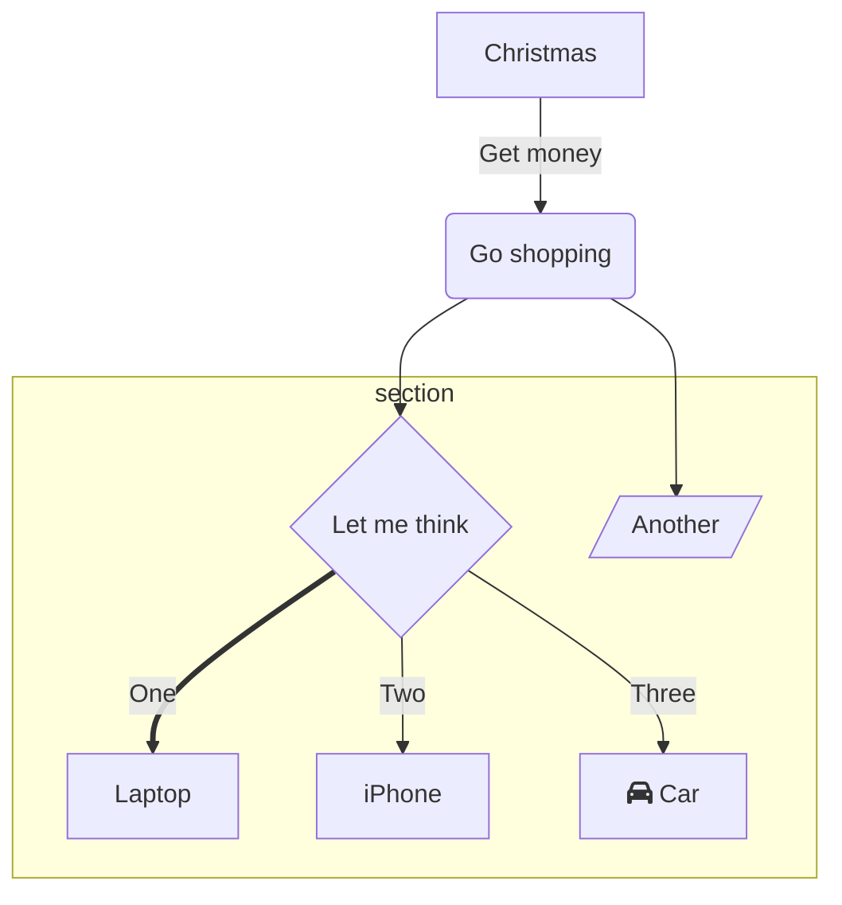
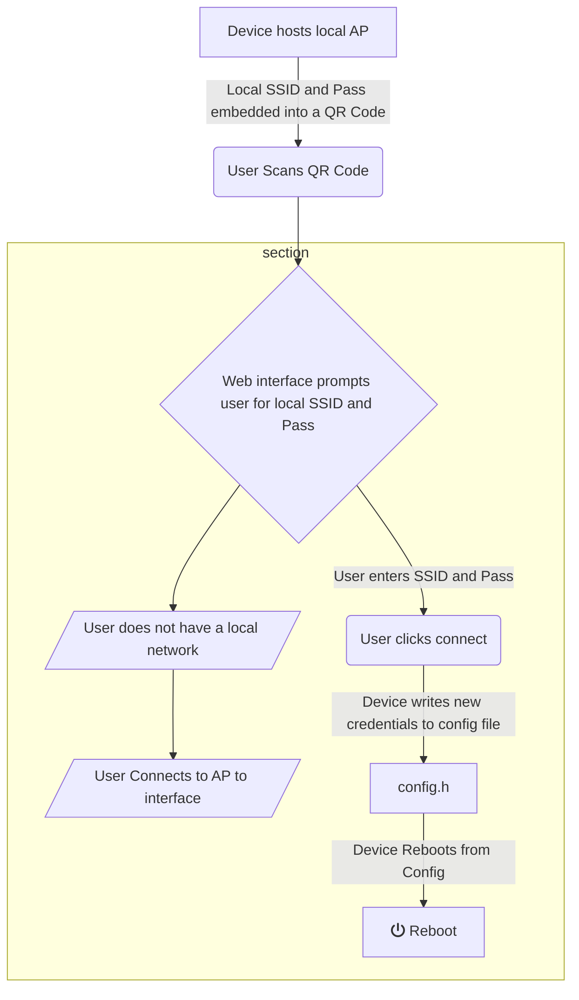

# HBAT-Software Private repo

Custom Software Stack files are located in lib and src.

main.cpp runs the control script, HMSmain library does the heavy lifting.

## LIB

[HMSmain Library](HMSmain_Back_End/lib/HMSmain)

## SRC

[HMSmain](HMSmain_Back_End/src)

## Note to Voxdale

For this project, we need to map the discharge curve of the system, in order to present the user with an accurate representation of charge and discharge states.
The discharge curve of our battery system is not linear, therefor a basic linear percentage calculation will not work.

Below i have one strategy, this strategy is simple to implement, however has low accuracy and could be prone to error.

Take minimum voltage reading of just before esp32 stops functioning, then
take the max voltage reading of a freshly charged battery (or input source).
The product of this subtraction is then divided by the realtime measured voltage
and multiplied by 100.

```python

def percentage_calc:
 Vmin # minimum possible voltage for the load to function
 Vmax # maximum voltage of the battery when in a fully charged state
 Vreal # real-time measured voltage for the whole system (or the sum of all series connected cells individual readings)
 Vmin - Vmax = X

 x = (X / Vreal) * 100
 return x
```

An alternative approach is to correctly map the voltage readings. Such as the example below, however this must be done in real-time to present accurate data to the user, and for the software to take correct actions based on the data of this curve.

## Mapping Bezier curve to voltage readings

According to this paper: [PEMFC Discharge Curve](https://github.com/Prometheon-Technologies/HBAT-Software/blob/main/sustainability-12-08127-v2.pdf)
the discharge curve matches a very predictable Bezier curve.


Currently, i am not able to correctly implement this approach into the software stack. Is Voxdale capable of doing this? Does voxdale have an alternative approach in mind?

My current thoughts were to map the voltage readings to an array, and set that array equal to the results of a mapping function containing the formula for the curve we wish to fit our data to.

## Current Project Flow-Chart



## Current Network Flow-Chart



## MQTT Broker Configuration and Connection

The MQTT Broker is a free service that allows you to publish and subscribe to MQTT messages.
To automate the connection process, we will use Multi-Cast DNS (mDNS/Zeroconf) to find the broker.
For this to work, you must have a broker on your local network, and you must have only **_1_** MQTT broker within the range of the client, otherwise the client will simply connect to the first broker it finds.

Using a Zeroconf approach we can avoid having to hard code the broker's IP address or hostname into the client device's firmware. Instead we can use **_DNS-SD_** and Avahi/Bonjour to discover the server hosting the MQTT broker.

To enable MQTT discovery on the broker, simply install avahi-daemon. For a Raspberry Pi, use the following command:

```bash
sudo apt-get install avahi-daemon
```

For this to work, the MQTT service needs to be advertised. On a Linux host system, Avahi can be configured to do this by including the following in /etc/avahi/services/mqtt.service:

```xml
<!DOCTYPE service-group SYSTEM "avahi-service.dtd">
<service-group>
 <name replace-wildcards="yes">MQTT on %h</name>
  <service>
   <type>_mqtt._tcp</type>
   <port>1883</port>
  </service>
</service-group>
```
