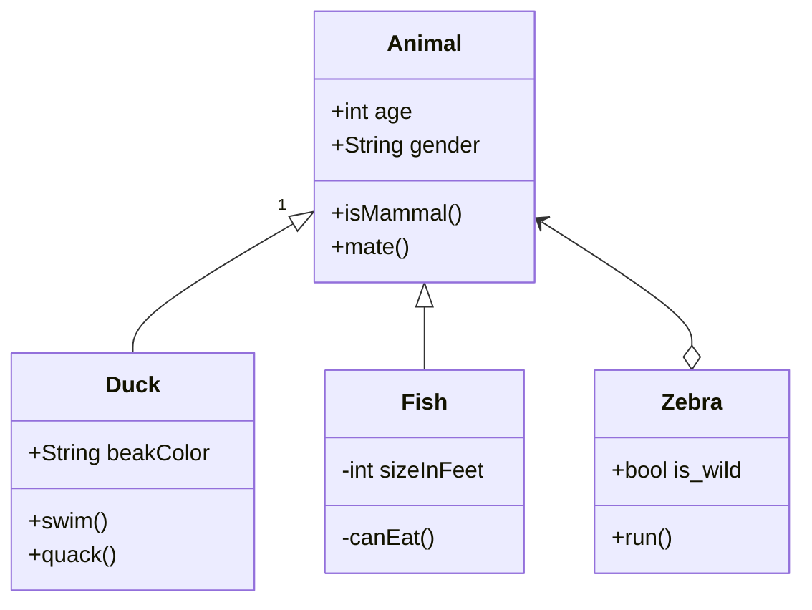
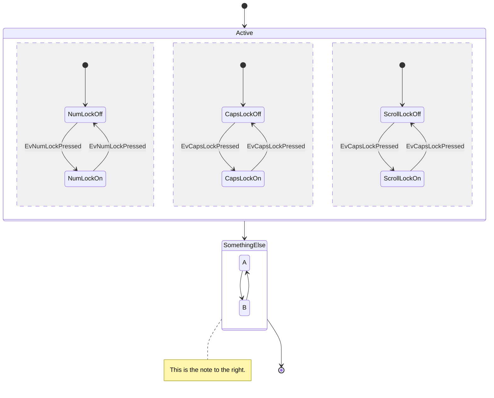
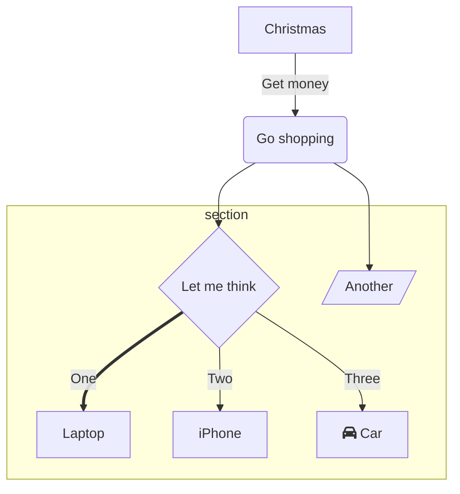

# This is a location for all code snippets related to this project

## Code Snippets

### C++

```cpp

void InitJsonData()
{
  data_arrays dataTosend;
  String json = AccumulateData().json;
  int maxTemp = AccumulateData().maxTemp;
  int maxVoltage = AccumulateData().maxVoltage;
  json = "";
  json += R"====({)====";

  json += R"====("stack_humidity":)====";
  json += (String)dataTosend.stack_humidity + ",\n";

  json += R"====("stack_temp":)====";
  json += (String)dataTosend.stack_temp + ",\n";

  json += R"====("relays":[)====";
  json += (String)dataTosend.relays[0] + "," + (String)dataTosend.relays[1] + "," + (String)dataTosend.relays[2] + "," + (String)dataTosend.relays[3] + "," + (String)dataTosend.relays[4] + "],\n";

  json += R"====("stack_voltage":)====";
  json += (String)dataTosend.stack_voltage + ",\n";

  json += R"====("fakeGraphData":[)====";
  json += "\n";
  for (int i = 0; i < 10; i++)
  {

    delay(0);
    json += R"====({"label": "🌡 )====" + (String)i + "\",\n";
    json += R"====("type": "temp",)====" + (String) "\n";
    json += R"====("value": )====" + (String)dataTosend.cell_temp[i] + (String) ",\n";
    json += R"====("maxValue": )====" + (String)maxTemp;
    json += R"====(})====" + (String) "\n";
    json += R"====(,)====";

    json += R"====({"label": "⚡ )====" + (String)i + "\",\n";
    json += R"====("type": "volt",)====" + (String) "\n";
    json += R"====("value": )====" + (String)dataTosend.cell_voltage[i] + (String) ",\n";
    json += R"====("maxValue": )====" + (String)maxVoltage;
    json += R"====(})====" + (String) "\n";

    if (i < 9)
    {
      json += R"====(,)====";
    };
  }
  json += R"====(])====";
  json += R"====(})====";
  json = "";
  Serial.println(json);
  MqttData.MQTTPublish("/HMS" ,json);
}

/******************************************************************************
 * Function: Accumulate DataTosend from sensor arrays
 * Description: This function accumulates all sensor data and stores it in the main data structure.
 * Parameters: None
 * Return: None
 ******************************************************************************/
data_arrays AccumulateData::AccumulateDataMainLoop()
{
  data_arrays dataTosend;
  // Flow Rate dataTosend
  dataTosend.flow_rate_sensor_status = Hum.SFM3003();
  if (dataTosend.flow_rate_sensor_status == 0)
  {
    // SFM3003 flow rate dataTosend in slm
    dataTosend.flow_rate = Hum.flow;
    // SFM3003 mass temp dataTosend
    dataTosend.flow_rate_sensor_temp = Hum.temperature;
  }
  else
  {
    SERIAL_DEBUG_LN(("Flow Rate Sensor Could Not Be Read\n"));
  }

  // Stack level dataTosend
  dataTosend.stack_humidity = Hum.StackHumidity();
  debugln(dataTosend.stack_humidity);
  dataTosend.stack_temp = Hum.AverageStackTemp();
  debugln(dataTosend.stack_temp);

  // Cell level dataTosend

  float *cell_temp = Cell_Temp.ReadTempSensorData();
  // loop through and store per cell temp data
  for (int i = 0; i < Cell_Temp.GetSensorCount(); i++)
  {
    dataTosend.cell_temp[i] = cell_temp[i];
    debugln(dataTosend.cell_temp[i]);
  }

  free(cell_temp);

  float *cell_voltage = HMSmain.readSensAndCondition();
  // loop through and store per cell voltage dataTosend
  for (int i = 0; i < Cell_Temp.GetSensorCount(); i++)
  {
    dataTosend.cell_voltage[i] = cell_voltage[i];
    debugln(dataTosend.cell_voltage[i]);
  }

  free(cell_voltage);

  dataTosend.stack_voltage = 0;

  int numSensors = Cell_Temp.GetSensorCount();
  if (numSensors > maxCellCount)
  {
    numSensors = maxCellCount;
  }
  for (int i = 0; i < numSensors; i++)
  {
    dataTosend.stack_voltage += cell_voltage[i];
    debugln(dataTosend.cell_temp[i]);
  }
  return dataTosend;
}

/******************************************************************************
 * Function: Main Sensor Data Structure
 * Description: This is the main Data Structure where all sensor data is accumulated. To be passed into the main program.
 * Parameters: None
 * Return: None
 ******************************************************************************/
struct data_arrays
{
    boolean relays[5];
    float stack_humidity;
    float stack_temp;
    float stack_voltage;
    float cell_temp[10];
    float cell_voltage[10];
    float flow_rate;
    float flow_rate_sensor_temp;
    int flow_rate_sensor_status;
};
```

```cpp
#define LARGE_NUMBER 12333
void my_delay(void) {
    for (volatile long count = LARGE_NUMBER ; count > 0; count--) ;
}
```

### C

```c


```

### JSON

```json


```

### Mermaid







## Calculate the range of Wifi signal strength

´´´txt
Signal transmission in ft^2 = ((dBm + 4,000) - 2,000) / 42.7

4,000 = nominal base dB of average consumer grade WIFI antenna
2,000 = Nominal base dB of peak signal interference
42.7 = a constant for conversion to square feet
´´´

```cpp
int signal_range = ((dBm + 4,000) - 2,000) / 42.7;

WiFi.setOutputPower(dBm);

1. For how long can a device be without connection?
2. What happens if data is lost?

From the point of view of the client:
a: How low is to low - when is the client not able to see the server
b: How close to this lowest point are we willing to go?


1. Client tells the server when it needs a stronger signal - do this in levels
2. Server lowers signal by a certain value each time frame 
3. Every x amount of time based on how long device can be without connection - it will pulse the signal at max sending out a wake up call to devices that have potentially lost connection
```

```cpp
if (!PRODUCTION) {
  // do development stuff
}
```

## USEFUL LINKS

[Mermaid Live Editor](https://mermaid-js.github.io/mermaid-live-editor/edit#eyJjb2RlIjoiZ3JhcGggVERcbiAgICBBW0NocmlzdG1hc10gLS0-fEdldCBtb25leXwgQihHbyBzaG9wcGluZylcbiAgICBCIC0tPiBDe0xldCBtZSB0aGlua31cbiAgICBDIC0tPnxPbmV8IERbTGFwdG9wXVxuICAgIEMgLS0-fFR3b3wgRVtpUGhvbmVdXG4gICAgQyAtLT58VGhyZWV8IEZbZmE6ZmEtY2FyIENhcl0iLCJtZXJtYWlkIjoie1xuICBcInRoZW1lXCI6IFwiYmFzZVwiXG59IiwidXBkYXRlRWRpdG9yIjpmYWxzZSwiYXV0b1N5bmMiOnRydWUsInVwZGF0ZURpYWdyYW0iOmZhbHNlfQ)

[Wifi QR code generator](https://qifi.org/)
